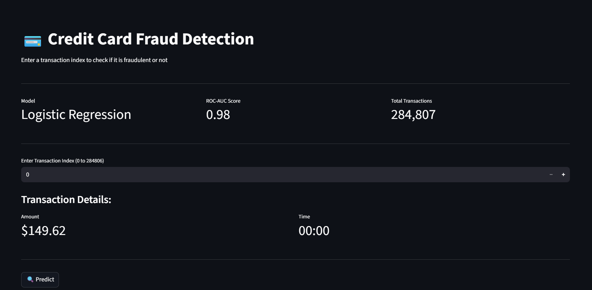
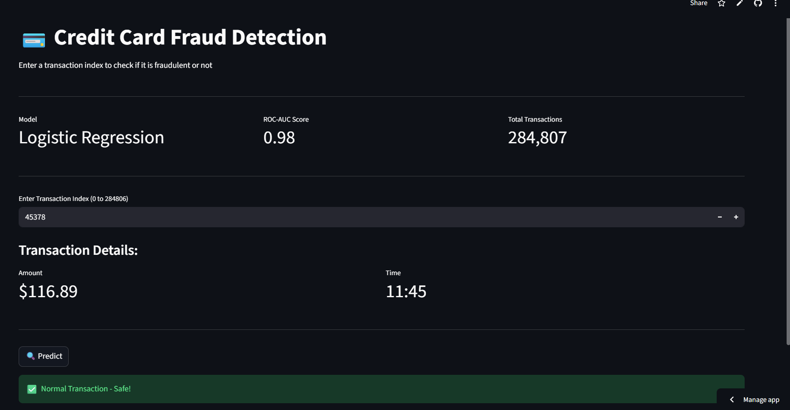
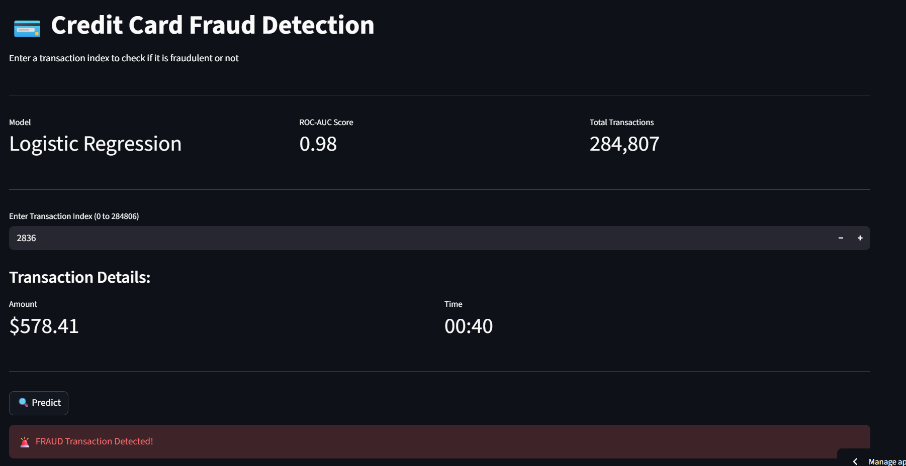
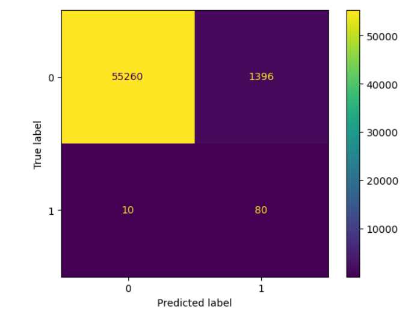
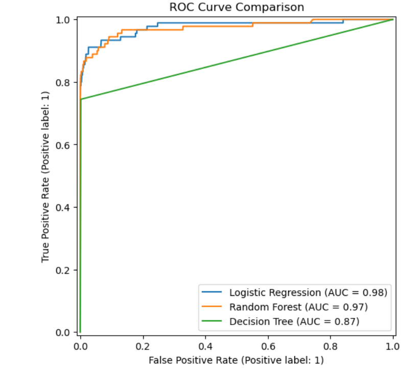
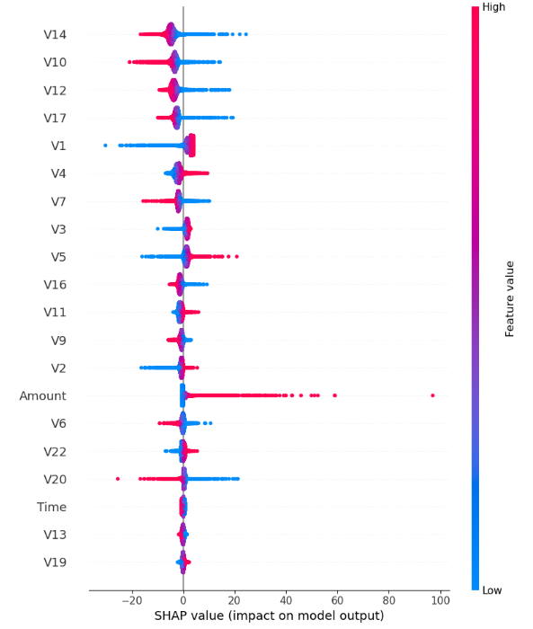

# 💳 Credit Card Fraud Detection

A machine learning web application that detects fraudulent credit card transactions using Logistic Regression with 0.98 ROC-AUC score, deployed using Streamlit.

---

## 📂 Dataset
The dataset is not included due to file size limitations.
Download it from Kaggle and place it in the project folder:
[Credit Card Fraud Detection Dataset](https://www.kaggle.com/datasets/mlg-ulb/creditcardfraud)

---

## 🎯 Problem Statement
Credit card fraud is a major problem in the financial industry. This project builds a machine learning model to automatically detect fraudulent transactions from a dataset of 284,807 transactions where only 0.17% are fraud.

---

## 🖥️ Live Demo
https://mahathi1989-creditcardfrauddetection-app-tbzac3.streamlit.app/

---

## 📊 Dataset
- Source: Kaggle - Credit Card Fraud Detection (ULB)
- Total Transactions: 284,807
- Fraud Transactions: 492 (0.17%)
- Features: V1-V28 (PCA transformed), Amount, Time

---

## ⚙️ Tech Stack
- Python
- Pandas, NumPy
- Scikit-learn
- Imbalanced-learn (SMOTE)
- SHAP
- Streamlit
- Matplotlib, Seaborn
- datasets

---

## 🔄 Project Workflow
1. Data Cleaning (removed 1081 duplicates)
2. Exploratory Data Analysis
3. Feature Scaling (StandardScaler)
4. Handling Class Imbalance (SMOTE)
5. Model Training and Comparison
6. Model Evaluation
7. SHAP Explainability
8. Streamlit Deployment

---

## 📈 Model Comparison

| Model | ROC-AUC Score |
|---|---|
| Logistic Regression | 0.98 🏆 |
| Random Forest | 0.97 |
| Decision Tree | 0.87 |

---

## 🔍 Key Findings
- Only 0.17% of transactions are fraudulent — severe class imbalance
- SMOTE was applied to balance the training data
- Logistic Regression outperformed Random Forest and Decision Tree
- V14 was the strongest fraud indicator according to SHAP analysis
- Low values of V14 strongly indicate fraudulent transactions
- Higher transaction amounts showed higher fraud probability

---

## 📊 SHAP Analysis
SHAP (SHapley Additive exPlanations) was used to explain model predictions:
- V14, V10, V12 were the top 3 most influential features
- V14 alone had an average SHAP impact of 4.5
- Amount was the 14th most important feature

---

## 🚀 How to Run Locally

1. Clone the repo
git clone https://github.com/mahathi1989/CreditCardFraudDetection.git

2. Install dependencies
pip install -r requirements.txt

3. Run the app
streamlit run app.py

---

## 📸 Screenshots

### 🏠 Home Page

### ⚡ Prediction Result

### 📊 Confusion Matrix

### 📈 ROC Curve

### 🧠 SHAP Explanation

---

## 👤 Author
Your Name
- GitHub: @mahathi1989
- LinkedIn: https://www.linkedin.com/in/neelima-mahathi-akula-570a3237a/